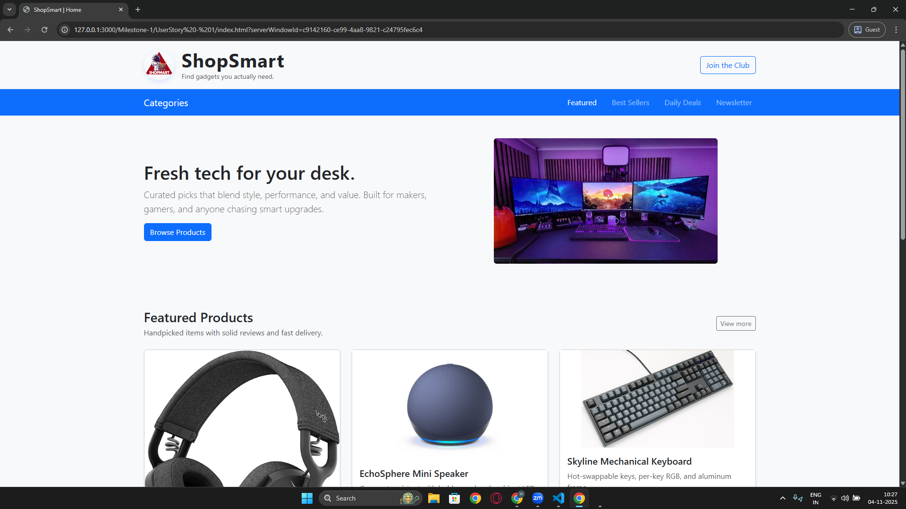
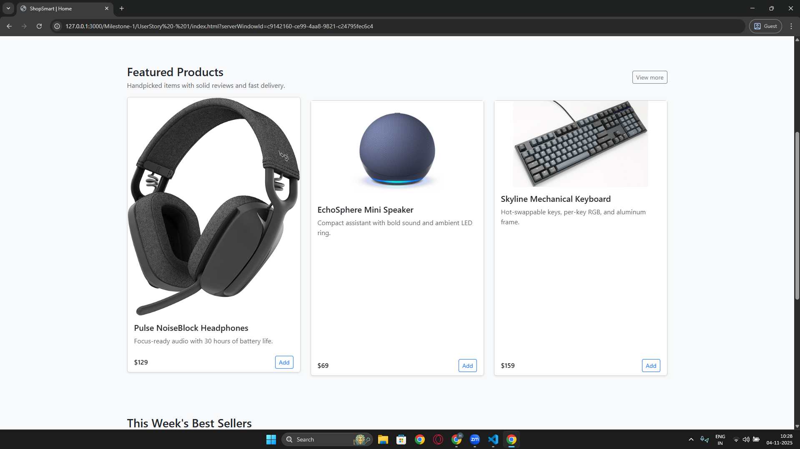
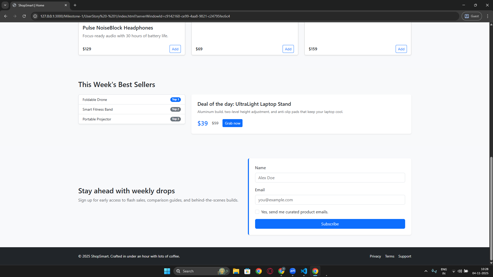
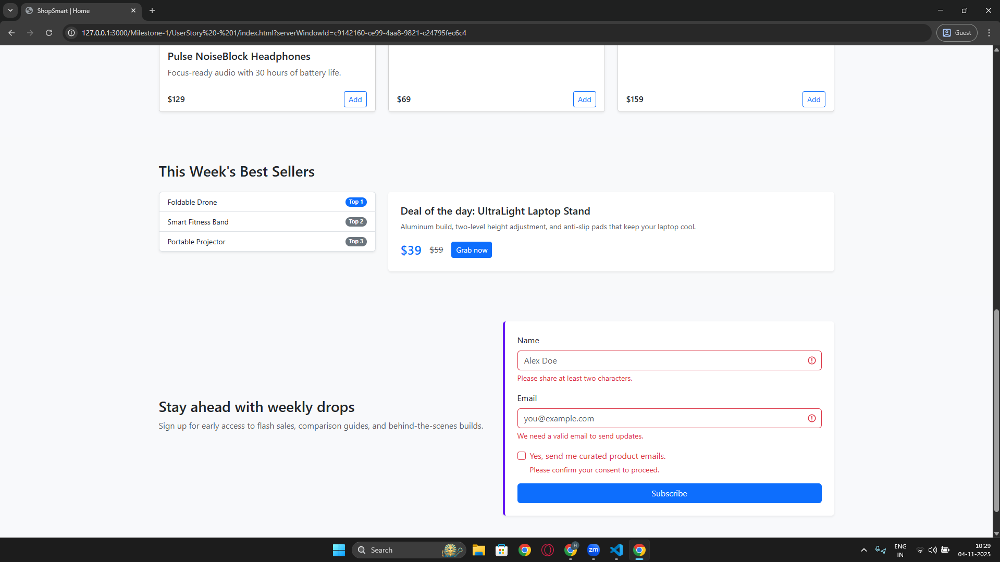
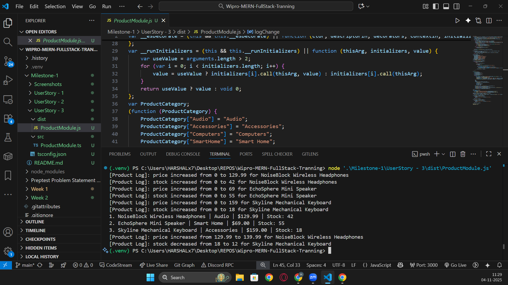

Milestone 1


This mini-report documents the three user stories implemented for the ShopSmart training portal. Each section captures the goal, screenshots, key snippets, and a quick explanation of the logic.


---
## User Story 1 – Product Showcase Home Page









**Snippet – Bootstrap Layout with Hero and Featured Cards**
```html
<header class="bg-light border-bottom">
    <div class="container py-3">
        <div class="row align-items-center">
            <div class="col-sm-6">
                <div class="d-flex align-items-center gap-3">
                    
                    <div>
                        <h1 class="m-0 fw-bold">ShopSmart</h1>
                        <p class="text-muted small mb-0">Find gadgets you actually need.</p>
                    </div>
                </div>
            </div>
            <div class="col-sm-6 text-sm-end mt-3 mt-sm-0">
                <a class="btn btn-outline-primary" href="#newsletter">Join the Club</a>
            </div>
        </div>
    </div>
</header>
```


**Logic:** The home page uses semantic HTML5 sections and Bootstrap’s grid to balance the brand block, hero banner, and featured product cards. Custom CSS adds subtle hover transitions so the three featured items pop without heavy scripting.


**Snippet – Newsletter Validation**
```html
<form class="newsletter-form p-4 rounded shadow-sm bg-white" novalidate>
    <input class="form-control" id="newsletterEmail" name="email" type="email" required>
    <button class="btn btn-primary w-100" type="submit">Subscribe</button>
</form>
<script>
    (function () {
        const form = document.querySelector('.newsletter-form');
        form.addEventListener('submit', (event) => {
            if (!form.checkValidity()) {
                event.preventDefault();
                event.stopPropagation();
            }
            form.classList.add('was-validated');
        });
    })();
</script>
```
**Logic:** Native form validation is paired with Bootstrap’s `.was-validated` styling. The script only prevents submission when fields fail checks, keeping the interaction light and immediate.


---


## User Story 2 – Product Listing with API Fetch & Filtering


**Snippet – Async Fetch with Loading/Error States**
```javascript
const loadProducts = async () => {
    toggleMessage(errorMessage, false);
    toggleMessage(emptyMessage, false);
    toggleMessage(loadingMessage, true);


    try {
        const response = await fetch('products.json');
        if (!response.ok) throw new Error(`Request failed: ${response.status}`);


        const products = await response.json();
        state.products = products;
        populateCategories(products);
        applyFilters();
    } catch (error) {
        console.error('Failed to load products', error);
        toggleMessage(errorMessage, true);
        productGrid.innerHTML = '';
    } finally {
        toggleMessage(loadingMessage, false);
    }
};
```
**Logic:** The async loader wraps the Fetch API in a `try/catch/finally`, showing a loading banner, swapping in an error alert on failure, and hydrating the UI when data is returned.


**Snippet – Filter Logic**
```javascript
const applyFilters = () => {
    const selectedCategory = categoryFilter.value;
    const priceBounds = getPriceFilterBounds(priceFilter.value);


    const filtered = state.products.filter((product) => {
        const matchesCategory = selectedCategory === 'all' || product.category === selectedCategory;
        const matchesPrice = !priceBounds || (product.price >= priceBounds.min && product.price <= priceBounds.max);
        return matchesCategory && matchesPrice;
    });


    renderProducts(filtered);
};
```
**Logic:** Filters run instantly whenever dropdowns change. The price helper converts option values into numeric ranges so the grid updates without extra API calls.


---


## User Story 3 – TypeScript Product Management Module





**Snippet – Product Interface and Decorated Accessors**
```typescript
enum ProductCategory { Audio = "Audio", Accessories = "Accessories", Computers = "Computers", SmartHome = "Smart Home", Wearables = "Wearables", Displays = "Displays" }


interface IProduct {
    id: number;
    name: string;
    category: ProductCategory;
    price: number;
    stock: number;
}


function TrackInventoryChange(label: "price" | "stock") {
    return function (value: ClassAccessorDecoratorTarget<Product, number>, context: ClassAccessorDecoratorContext<Product, number>) {
        return {
            get() { return value.get.call(this); },
            set(newValue: number) {
                if (newValue < 0) throw new Error(`${String(context.name)} cannot be negative`);
                const currentValue = value.get.call(this);
                if (currentValue !== newValue) {
                    const changeType = newValue > currentValue ? "increase" : "decrease";
                    console.log(`[Product Log]: ${label} ${changeType}d from ${currentValue} to ${newValue} for ${this.name}`);
                }
                value.set.call(this, newValue);
            }
        };
    };
}
```
**Logic:** A strict interface defines each product, while the decorator wraps accessor setters to validate inputs and emit console logs whenever price or stock changes.


**Snippet – Inventory Map and Iteration**
```typescript
type InventoryEntry = [number, Product];


const inventory = new Map<number, Product>();
const seedProducts: InventoryEntry[] = [
    [1, new Product(1, "NoiseBlock Wireless Headphones", ProductCategory.Audio, 129.99, 42)],
    [2, new Product(2, "EchoSphere Mini Speaker", ProductCategory.SmartHome, 69.0, 55)],
    [3, new Product(3, "Skyline Mechanical Keyboard", ProductCategory.Accessories, 159.0, 18)],
];


seedProducts.forEach(([id, product]) => inventory.set(id, product));


for (const [id, product] of inventory.entries()) {
    console.log(`${id}. ${product.name} | ${product.category} | $${product.price.toFixed(2)} | Stock: ${product.stock}`);
}
```
**Logic:** Products are stored in a typed tuple array before being dropped into a `Map`. A simple `for...of` loop prints the inventory, while helper functions adjust price and stock to trigger the decorator output.


---


### Run & Build Notes


- **User Story 1 & 2:** Open the respective `index.html` files through a local server (e.g., `npx serve`) so images and fetch requests resolve correctly.
- **User Story 3:** From `Milestone-1/UserStory - 3`, compile with `npx --yes tsc --project tsconfig.json` and run using `node dist/ProductModule.js`.


